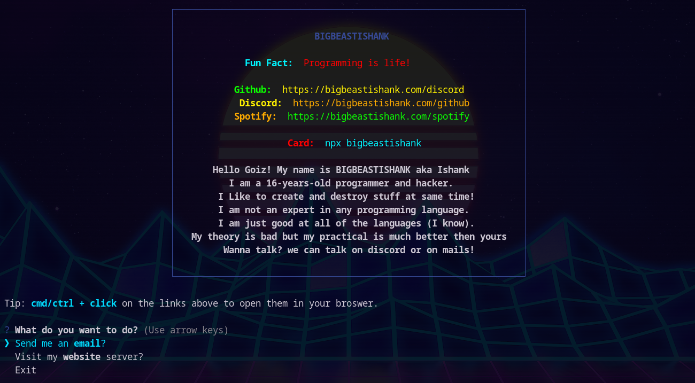

# NPX card

A geeky way to introduce yourself in terminal!

hit `npx bigbeastishank` on your terminal to know more about me!

## Output

## Make Your Own 

- clone this repository `git clone https://github.com/BIGBEASTISHANK/npx-bigbeastishank.git`
- `npm i` to install all the packages.
- Try `node .` to check if everything is fine.
- Make changes as per your needs.
- Make sure you have a [npmjs](https://www.npmjs.com/) account and have verified email.
- Run `npm login` to login.
- Then, publish the package by typing `npm publish`.

## Credits 
- [BruceMacGary](https://github.com/brucemacgary) for the help.
